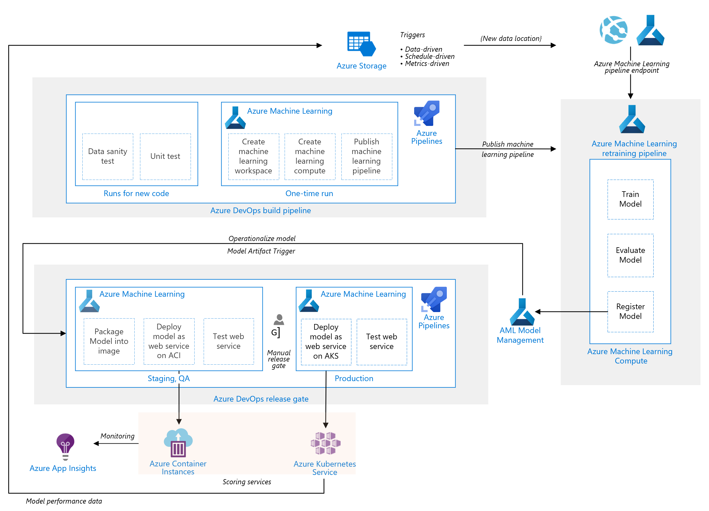

# Use Chest X-rays Images in Azure Machine Learning Studio to predict Covid-19 and deploy a web service to Azure Kubernetes Service (AKS). 
# In addition, consume the model to predict through Microsoft Power Apps.

In this lab, I will walk you through on how to apply machine learning to predict COVID-19 cases from chest X-rays. By following the steps in this lab, you will be able to understand get started. I am hoping to reach individuals who are able to contribute their skills to this effort.

You can use this url to try it out [Covid Chestxray image upload web service](https://http://covid19screening.azurewebsites.net/)
# Reference Architecture



## Deploy Required Resources
Click the below button to upload the provided ARM template to the Azure portal, which is written to automatically deploy and configure the following resources:
  1. An Azure Machine Learning Workspace set to Basic
  2. Azure Key Vault
  3. Application Insights
  4. Storage Account (general purpose v2) with LRS (Locally-redundant storage)
  5. Container Registry
  6. Kubernetes Services
  
 </br>
    <a href="https%3A%2F%2Fraw.githubusercontent.com%2FHrashid789%2Fx-rayPredictionCovid-19%2Fmaster%2FAzureDeploy.json" target="_blank">
        
    </a>

## Dataset

1) [Covid Chestxray dataset](https://data.mendeley.com/datasets/rscbjbr9sj/2)
2) [Mendeley](https://data.mendeley.com/datasets/rscbjbr9sj/2)

## Using AML to create a new .ipynb and train a model:
Before you begin make sure to create a folder called "data" with subfolders "covid & Normal" and upload all the images from the dataeset folder from this Github repo.
### Import Python libraries
```bash
import warnings
warnings.filterwarnings("ignore") 

import os
import math
from PIL import Image
import seaborn as sns
from mlxtend.plotting import plot_confusion_matrix
from sklearn.model_selection import train_test_split
from sklearn.metrics import classification_report, confusion_matrix
import numpy as np
import pandas as pd
import cv2
import glob
import matplotlib.pyplot as plt
```
### Loading Covid X-ray Images
```bash
dataset_folder = 'project/dataset/covid/'
```
### Some random Images Covid X-ray
```bash
image_id = '1-s2.0-S1684118220300682-main.pdf-003-b2.png'
img_data = Image.open(dataset_folder + image_id)
img_data

image_id = '03BF7561-A9BA-4C3C-B8A0-D3E585F73F3C.jpeg'
img_data = Image.open(dataset_folder + image_id)
img_data

image_id = '6C94A287-C059-46A0-8600-AFB95F4727B7.jpeg'
img_data = Image.open(dataset_folder + image_id)
img_data

image_id = '16660_1_1.jpg'
img_data = Image.open(dataset_folder + image_id)
img_data
```
### Loading Covid dataset all images and reshaping into 300*300 because all images have different sizes
```bash
Images=[]
Covid_data = 'project/dataset/covid/'

for img in os.listdir(Covid_data):
    img_array = cv2.imread(os.path.join(Covid_data,img), cv2.IMREAD_GRAYSCALE)
    img_pil = Image.fromarray(img_array)
    img_300x300 = np.array(img_pil.resize((300, 300), Image.ANTIALIAS))
    img_array = (img_300x300.flatten())
    img_array  = img_array.reshape(-1,1).T
    with open('Covid_Images.csv', 'ab') as f:
        np.savetxt(f, img_array, delimiter=",")
```
### Loading Covid images data in csv file that we saved above
```bash
Covid_data = pd.read_csv('Covid_Images.csv', header=None)

Covid_data
```
### Data Analysis and Preprocessing
#### First five records
```bash
Covid_data.head()
```
#### last five records
```bash
Covid_data.tail()
```
#### Lenght of data
```bash
len(Covid_data)
```
#### Data information
```bash
Covid_data.info()
```
#### Giving class 0 to Covid images
```bash
Covid_data['class']=0
Covid_data_X=Covid_data.drop(columns=['class'])
Covid_data_y=Covid_data['class']
```
#### Rescalling the pixel values in the range of 0 and 1
```bash
Covid_data_X=Covid_data_X/255
Covid_data_X=np.array(Covid_data_X)
Covid_data_y=np.array(Covid_data_y)
print(Covid_data_X.shape)
Covid_data_y.shape
```
#### Loading Covid data
```bash
dataset_folder = 'project/dataset/Normal/'
```
#### Some random Images of NORMAL X-ray Images
```bash
image_id = 'IM-0115-0001.jpeg'
img_data = Image.open(dataset_folder + image_id)
img_data

image_id = 'IM-0168-0001.jpeg'
img_data = Image.open(dataset_folder + image_id)
img_data

image_id = 'IM-0187-0001.jpeg'
img_data = Image.open(dataset_folder + image_id)
img_data

image_id = 'IM-0207-0001.jpeg'
img_data = Image.open(dataset_folder + image_id)
img_data
```
#### Loading Normal dataset all images and reshaping into 300*300 because all images have different sizes
```bash
Images=[]
Normal_data = 'project/dataset/Normal/'

for img in os.listdir(Normal_data):
    img_array = cv2.imread(os.path.join(Normal_data,img), cv2.IMREAD_GRAYSCALE)
    img_pil = Image.fromarray(img_array)
    img_300x300 = np.array(img_pil.resize((300, 300), Image.ANTIALIAS))
    img_array = (img_300x300.flatten())
    img_array  = img_array.reshape(-1,1).T
    with open('Normal_Images.csv', 'ab') as f:
        np.savetxt(f, img_array, delimiter=",")
```
#### Loading Normal images data in csv file that we saved aboved
```bash
Normal_data = pd.read_csv('Normal_Images.csv', header=None)
```
### Data Analysis and Preprocessing
#### First five records
```bash
Normal_data.head()
```
#### last five records
```bash
Normal_data.tail()
```
#### Lenght of data
```bash
len(Normal_data)
```
#### Data information
```bash
Normal_data.info()
```
#### Giving class 1 to Normal images
```bash
Normal_data['class']=1
Normal_data_X=Normal_data.drop(columns=['class'])
Normal_data_y=Normal_data['class']
```
#### Rescalling the pixel values in the range of 0 and 1
```bash
Normal_data_X=Normal_data_X/255
Normal_data_X=np.array(Normal_data_X)
Normal_data_y=np.array(Normal_data_y)
print(Normal_data_X.shape)
Normal_data_y.shape
```
### Combining the Covid and Normal images data
```bash
X=np.concatenate((Covid_data_X,Normal_data_X), axis=0)
y=np.concatenate((Covid_data_y,Normal_data_y), axis=0)
print("The Feature data has the shape ", X.shape)
print("The Label data has the shape ", y.shape)
unique, counts = np.unique(y, return_counts=True)
plt.figure(figsize=(8,6))
sns.barplot(x=unique, y=counts)
plt.title('Counts of X-ray images of Covid and Normal')
plt.ylabel('Count')
plt.xlabel('Class (0:Covid, 1:Normal)')
```
### Spliting Dataset into 70% Training and 30% Testing
```bash
from sklearn.model_selection import train_test_split
X_train, X_test, y_train, y_test = train_test_split(X, y, test_size=0.30, random_state=2)
```
### SVM Support Vector Machine Algorithm
```bash
from sklearn.svm import LinearSVC

svc=LinearSVC(C=1, max_iter=500)
svc= svc.fit(X_train , y_train)
svc
```
### Accuracy
```bash
y_pred1 = svc.predict(X_test)
dm=svc.score(X_test, y_test)
print('Accuracy score= {:.2f}'.format(svc.score(X_test, y_test)))
```
### Precision, Recall, F1
```bash
from sklearn.metrics import classification_report, confusion_matrix


print('\n')
print("Precision, Recall, F1")
print('\n')
CR=classification_report(y_test, y_pred1)
print(CR)
print('\n')
```
### Confusion Matrix
```bash
from sklearn.metrics import classification_report, confusion_matrix
from mlxtend.plotting import plot_confusion_matrix


print('\n')
print("confusion matrix")
print('\n')
CR=confusion_matrix(y_test, y_pred1)
print(CR)
print('\n')

fig, ax = plot_confusion_matrix(conf_mat=CR,figsize=(10, 10),
                                show_absolute=True,
                                show_normed=True,
                                colorbar=True)
plt.show()
```
### Graph comparison of predictions and true
```bash
y_pred = svc.predict(X_test)
a=pd.DataFrame()
a['true']=y_test
a['predictions']=y_pred

plt.figure(figsize=(25, 10))
plt.subplot(1,1,1)
plt.plot(a.true.values,color='red',label='True Cases')
plt.plot(a.predictions.values,color='green',label='Predictions')

plt.title('Comparison of true and predictions')
plt.xlabel('Counts of images')
plt.ylabel('Class as 0 cobid or 1 as normal')
plt.legend(bbox_to_anchor=(1, 1))
plt.show()
```
### Random Forest Algorithm
```bash
from sklearn.ensemble import RandomForestClassifier

raf=RandomForestClassifier(min_samples_leaf=20, min_samples_split=20,random_state=100)
raf= raf.fit(X_train , y_train)
raf
```
### Accuracy
```bash
y_pred1 = raf.predict(X_test)
rf=raf.score(X_test, y_test)
print('Accuracy score= {:.2f}'.format(raf.score(X_test, y_test)))
```
### Precision, Recall, F1
```bash
from sklearn.metrics import classification_report, confusion_matrix


print('\n')
print("Precision, Recall, F1")
print('\n')
CR=classification_report(y_test, y_pred1)
print(CR)
print('\n')
```
### Confusion Matrix
```bash
from sklearn.metrics import classification_report, confusion_matrix
from mlxtend.plotting import plot_confusion_matrix


print('\n')
print("confusion matrix")
print('\n')
CR=confusion_matrix(y_test, y_pred1)
print(CR)
print('\n')

fig, ax = plot_confusion_matrix(conf_mat=CR,figsize=(10, 10),
                                show_absolute=True,
                                show_normed=True,
                                colorbar=True)
plt.show()
```
### Comparison of all algorithms Results
```bash
pip install PrettyTable
from prettytable import PrettyTable
x = PrettyTableprg()
print('\n')
print("Comparison of all algorithm results")
x.field_names = ["Model", "Accuracy"]


x.add_row(["SVM Algorithm", round(dm,2)])
x.add_row(["Random Forest Algorithm", round(rf,2)])

print(x)
print('\n')
```
### Best Model is SVM algorithm with higest accuracy
```bash
x = PrettyTable()
print('\n')
print("Best Model.")
x.field_names = ["Model", "Accuracy"]
x.add_row(["SVM",round(dm,2)])
print(x)
print('\n')
```
### Now, as we know SVM working good so going to train on all data
```bash
svc=LinearSVC(C=1, max_iter=500)
svc= svc.fit(X , y)
svc
```
### Saving Trained model
```bash
import pickle

Train_model='Trained_model'
with open(Train_model, 'wb') as file:
    pickle.dump(svc, file)
```
### Loading saved model
```bash
import pickle
Train_model='Trained_model'
with open(Train_model, 'rb') as file:
    Train_model_loaded = pickle.load(file)
```
### Loading X-ray image from X_ray_Image_for_prediction
```bash
Images=[]
data = 'project/X_ray_Image_for_prediction/'

for img in os.listdir(data):
    img_array = cv2.imread(os.path.join(data,img), cv2.IMREAD_GRAYSCALE)
    img_pil = Image.fromarray(img_array)
    img_300x300 = np.array(img_pil.resize((300, 300), Image.ANTIALIAS))
    img_array = (img_300x300.flatten())
    img_array  = img_array.reshape(-1,1).T
img_array.shape
```
### The image is from the Covid x-ray so the model should predict Covid as well
```bash
from IPython.display import display
from PIL import Image
covid="project/covid.jpg"
healthy="project/healthy.jpg"
aa=Train_model_loaded.predict(img_array)
if aa==0:
    print("Covid X-ray")
    display(Image.open(covid))
else:
    print("Normal X-ray")
    display(Image.open(healthy))
```

## Deploying a web service to Azure Kubernetes Service (AKS)

### Step 1:- Create an Azure Machine Learning workspace
1.	Sign in to the Azure portal by using the credentials for your Azure subscription.
2.	In the upper-left corner of Azure portal, select + Create a resource.
3.	Use the search bar to find Machine Learning.
4.	Select Machine Learning.
5.	In the Machine Learning pane, select Create to begin.
6.	Provide the required information to configure your new workspace

### Step 2: Create a notebook
After creation of Azure Machine learning workspace, now open the azure ML workspace and go to the “compute” section and create new instances of compute. 
Now launch the studio, and go to the “New” section for creation of the notebook and type the name of the notebook and select the file type as Notebook.
Gave name as “CovidXrayNote.ipynb”

### Step 3: Upload the Data in zip format
Go to the root folder of your user or project, click the upload icon and select the zip file of data for using your project.
Now open your notebook, which we have created already and provide the script for the extraing the zip file into the required path.
 ```bash
Import zipfile
import os
datafile = "CovidXRAY Dataset.zip"
datafile_dbfs = os.path.join("/Data/" + mountname, datafile)

print ("unzipping takes approximatelly 2 minutes")
zip_ref = zipfile.ZipFile(datafile_dbfs, 'r')
zip_ref.extractall("/Data/" + mountname)
zip_ref.close()
 ```
### Step 4: Import the libraries(CovidXrayNote.ipynb)
Import the required libraries.
CovidXrayNote file is used to train and test the model classification of images. And check the accuracy of the model.
### Step 5: Get the workspace(DeployNotebook.ipynb)
This file is used to deploy the model in AKS service.
Import the libraries.
Load existing workspace
```bash
ws = Workspace.from_config()
print(ws.name, ws.resource_group, ws.location, ws.subscription_id, sep='\n')
ws.write_config()
ws.get_details()
 ```
### Step 6: Register the model
Register an existing trained model, add description and tags.
```bash
## AKS Model Registration 
from azureml.core.model import Model
aksmodel = Model.register(model_path = '/mnt/batch/tasks/shared/LS_root/mounts/clusters/mlcovidcompute/code/Users/harash/Trained_model', # this points to a local file
                       model_name = "aks_covid.pkl", # this is the name the model is registered as
                       tags = {'area': "covid", 'type': "classification"},
                       description = "covid xray",
                       workspace = ws)

print(aksmodel.name, aksmodel.description, aksmodel.version)
 ```
### Step 7: Create the Environment
Create an environment that the model will be deployed with
```bash
#custom Deployment Environment
from azureml.core import Environment
from azureml.core.conda_dependencies import CondaDependencies


environment = Environment('covid-environment')
environment.python.conda_dependencies = CondaDependencies.create(pip_packages=[
    'azureml-defaults',
    'inference-schema[numpy-support]',
    'joblib',
    'numpy',
    'scikit-learn',
    'Pillow',
    'scikit-image==0.15.0',
    'opencv-python==4.2.0.34'
])
 ```
### Step 8: Write the Entry script(score.py)
Write the script that will be used to predict on your model
Now, create a locally “score.py” file and paste the below code and save it.
Go to current project or user folder and upload the score.py file in azure workspace.
```bash
import json
import joblib
from azureml.core.model import Model
import os
import PIL
from PIL import Image
import numpy as np
import pandas as pd
#import cv2
import flask
import pickle
import werkzeug
from werkzeug.utils import secure_filename
from skimage import io
import requests
from io import BytesIO
import azureml.core
from azureml.core import Workspace

# Called when the service is loaded
print('get dir',os.getcwd())

def init():
    global model
    print(os.getcwd())
    # Get the path to the registered model file and load it
    model_path = Model.get_model_path('covid-xray-model')
    model = joblib.load(model_path)

    # Called when a request is received
def run(url):
    # Get the input data as a numpy array
    img_array = io.imread(url, as_grey=True)
    img_pil = Image.fromarray(img_array)
    img_300x300 = np.array(img_pil.resize((300, 300), Image.ANTIALIAS))
    img_array = (img_300x300.flatten())
    img_array = img_array.reshape(-1, 1).T

    predictions = model.predict(img_array)
    # Return the predictions as any JSON serializable format
    return predictions.tolist()
 ```
### Step 9: Create the inferenceConfig 
Create the inference config that will be used when deploying the model
```bash
#inferenceConfig
from azureml.core.model import InferenceConfig
from azureml.core.compute import AksCompute, ComputeTarget
from azureml.core.webservice import Webservice, AksWebservice

inference_config = InferenceConfig(entry_script='./score.py', environment=environment)
#inf_config = InferenceConfig(entry_script='./score.py', environment=environment)
 ```
### Step 10: AKS Cluster
This is a one time setup. You can reuse this cluster for multiple deployments after it has been created. If you delete the cluster or the resource group that contains it, then you would have to recreate it.
```bash
# Use the default configuration (can also provide parameters to customize)
prov_config = AksCompute.provisioning_configuration()

aks_name = 'covid-xray-aks1' 
# Create the cluster
aks_target = ComputeTarget.create(workspace = ws, 
                                  name = aks_name, 
                                  provisioning_configuration = prov_config)
```
### Step 11: Deploy web service to AKS
```bash
## Deploy Script
# Set the web service configuration (using default here)
aks_config = AksWebservice.deploy_configuration()

# # Enable token auth and disable (key) auth on the webservice
# aks_config = AksWebservice.deploy_configuration(token_auth_enabled=True, auth_enabled=False)

#%%time
aks_service_name ='aks-covid-service1'

aks_service = Model.deploy(workspace=ws,
                           name=aks_service_name,
                           models=[model],
                           inference_config=inference_config,
                           deployment_config=aks_config,
                           deployment_target=aks_target)

aks_service.wait_for_deployment(show_output = True)
print(aks_service.state)


Get the aks service URL and Keys

print(aks_service.scoring_uri)

key1, Key2 = aks_service.get_keys()
print(key1)
```
### Step 12: Test the web service(ClientService.ipynb)
```bash 
import requests

import json
url ='https://qnacovdi19app-bot.azurewebsites.net/image/Normal.jpeg'
url_c ='https://qnacovdi19app-bot.azurewebsites.net/image/Covid.png'

endpoint_aks ='http://52.148.194.176:80/api/v1/service/aks-covid-service1/score'
key1 ='egfG7b8is01WqgDdCvaN0eKohbluGr7y'

# # If (key) auth is enabled, don't forget to add key to the HTTP header.
headers = {'Content-Type':'application/json', 'Authorization': 'Bearer ' + key1}

# # If token auth is enabled, don't forget to add token to the HTTP header.
# headers = {'Content-Type':'application/json', 'Authorization': 'Bearer ' + access_token}

resp = requests.post(endpoint_aks, url_c, headers=headers)
res =''
respose =resp.text
respose = respose.replace('[','').replace(']','')
if (respose == '1'):
    res ='Normal'
else:
    res ='Covid'


print("prediction:", res)
```

### Limitations and Considerations

This is a demo to showcase the capabiliites of Azure machine learning and AKS.  It is not intended to be a framework or scalable architecture for all scenarios, though it can give you an idea of what your scenario might end up looking like.

## Further reading
- [Microsoft Learn AML with Hands-on-Labs](https://github.com/MicrosoftDocs/mslearn-aml-labs)
- [Azure Machine Learning documentation](https://docs.microsoft.com/en-in/azure/machine-learning/)
- [Deploy a Model in Azure Container Instances](https://docs.microsoft.com/en-in/azure/machine-learning/tutorial-deploy-models-with-aml)


